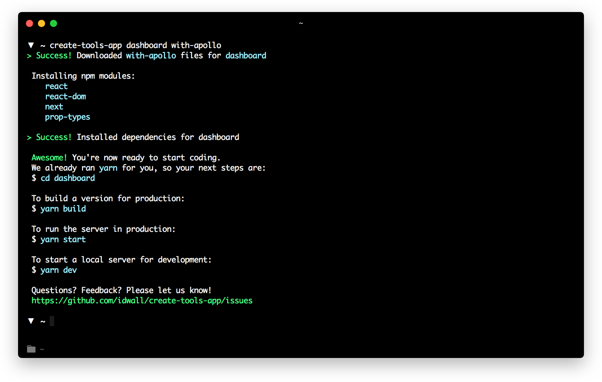

# Create Tools App [](https://travis-ci.org/bukinoshita/create-tools-app)

> The easiest way to create a [React](https://facebook.github.io/react) app with Next.js or Webpack for Tools Squad

<br/>



## Installation

Install it once globally:

```sh
npm install -g create-tools-app
```

**You’ll need to have Node >= 6 on your machine**. You can use [`n`](https://github.com/tj/n#installation) to easily switch Node versions between different projects.

### Creating an App

To create a new app, run:

```sh
create-tools-app <project-directory> <example>
```

Questions? Feedback? [Please let us know](https://github.com/idwall/create-tools-app/issues/new)

## License

MIT © [Squad Tools](license)
